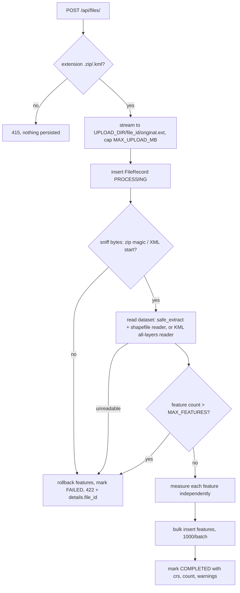

# Geospatial Measurement API

Upload a zipped Shapefile or a KML file, get every feature measured in a
suitable projected CRS (area for polygons, length for lines) over REST.

- **Formats:** `.zip` (exactly one ESRI Shapefile) and `.kml` (all layers)
- **Correct CRS handling:** never measures in degrees — every feature is
  reprojected to its local UTM zone (UPS at the poles)
- **Graceful odd input:** invalid polygons repaired, points marked
  NOT_APPLICABLE, collections/empty geometries UNSUPPORTED, per-feature
  errors never fail the file
- **Production habits:** size caps, Zip-Slip defense, XXE defense, single
  error envelope, SQLite persistence, OpenAPI docs, CI, 85%+ coverage

## Setup

Requires Python 3.12+. [uv](https://docs.astral.sh/uv/) is recommended.

```bash
git clone https://github.com/Eswar809/geospatial-measurement-api && cd geospatial-measurement-api
uv venv && uv pip install -e ".[dev]"
cp .env.example .env   # optional, defaults work out of the box
uv run uvicorn app.main:app --reload
```

- Interactive docs: http://localhost:8000/docs
- Health: `curl http://localhost:8000/health` → `{"status":"ok"}`
- Tests: `uv run pytest` (slow smoke: `uv run pytest -m slow`)
- Lint: `uv run ruff check . && uv run ruff format --check .`
- Docker: `docker build -t geo-api . && docker run -p 8000:8000 -v geo-data:/app/data geo-api`

Config lives in `.env` (see `.env.example`): `DATABASE_URL`,
`UPLOAD_DIR`, `MAX_UPLOAD_MB` (50), `MAX_UNCOMPRESSED_MB` (250),
`MAX_ZIP_ENTRIES` (50), `MAX_FEATURES` (100000), `LOG_LEVEL`.

## API

| Method | Path | Behavior |
|---|---|---|
| `POST` | `/api/files/` | Multipart `file` (`.zip`/`.kml`). 201 + `Location` header. Errors: 400 empty, 413 too large, 415 wrong extension, 422 unreadable content |
| `GET` | `/api/files/{id}/` | File info. 404 unknown/malformed id |
| `GET` | `/api/files/{id}/measurements/` | Paginated measurements. Query: `limit` (default 500, max 5000), `offset`, `include_geometry` (default true). 404 unknown id, 409 not COMPLETED |
| `GET` | `/health` | Liveness probe |

All failures share one envelope: `{"error": {"code", "message", "details"}}`.
Codes: `UNSUPPORTED_FILE_TYPE`, `EMPTY_FILE`, `FILE_TOO_LARGE`,
`INVALID_ARCHIVE`, `INVALID_GEODATA`, `UNSUPPORTED_CRS`, `NOT_FOUND`,
`NOT_READY`, `INTERNAL_ERROR`. When a record already exists,
`error.details.file_id` points to the FAILED record.

### Examples (real output from `samples/`)

```bash
curl -X POST -F "file=@samples/survey.kml" http://localhost:8000/api/files/
# 201 Created, Location: /api/files/b136deb58f3a44068bf445096edbb49c/
```

```json
{
  "id": "b136deb58f3a44068bf445096edbb49c",
  "filename": "survey.kml",
  "file_type": "KML",
  "status": "COMPLETED",
  "feature_count": 5,
  "crs": "EPSG:4326",
  "crs_assumed": false,
  "warnings": [],
  "created_at": "2026-10-07T10:18:01.881844Z"
}
```

```bash
curl "http://localhost:8000/api/files/b136deb58f3a44068bf445096edbb49c/measurements/?limit=2"
```

```json
{
  "file_id": "b136deb58f3a44068bf445096edbb49c",
  "summary": {
    "by_geometry_type": {"GeometryCollection": 1, "LineString": 1, "Point": 1, "Polygon": 1, "Unknown": 1},
    "by_measurement_status": {"MEASURED": 2, "NOT_APPLICABLE": 1, "UNSUPPORTED": 2},
    "total_area_m2": 955701.2086,
    "total_length_m": 2437.118
  },
  "pagination": {"limit": 2, "offset": 0, "total": 5},
  "features": [
    {
      "index": 0,
      "layer": "Parcels",
      "geometry_type": "LineString",
      "crs": "EPSG:4326",
      "properties": {"Name": "Access road"},
      "geometry": {"type": "LineString", "coordinates": [[72.87, 19.07, 0.0], [72.885, 19.075, 0.0], [72.89, 19.08, 0.0]]},
      "measurement": {
        "status": "MEASURED",
        "area_m2": null,
        "perimeter_m": null,
        "length_m": 2437.118,
        "measurement_crs": "EPSG:32643",
        "warnings": []
      }
    }
  ]
}
```

Units are meters / square meters, rounded to 4 decimals at serialization
only. Geometry is returned in the source CRS (altitude preserved as read),
omitted when `include_geometry=false`. Summary aggregates are computed with
SQL over the whole file, not just the current page.

```bash
curl -X POST -F "file=@samples/parcels_epsg32643.zip" http://localhost:8000/api/files/
```

```json
{
  "id": "f7f14fc976144b26acfc81ff1710ac93",
  "filename": "parcels_epsg32643.zip",
  "file_type": "SHAPEFILE",
  "status": "COMPLETED",
  "feature_count": 2,
  "crs": "EPSG:32643",
  "crs_assumed": false,
  "warnings": [],
  "created_at": "2026-10-07T10:18:26.477636Z"
}
```

Errors:

```bash
curl -X POST -F "file=@x.txt" http://localhost:8000/api/files/
# 415 {"error": {"code": "UNSUPPORTED_FILE_TYPE",
#   "message": "unsupported file type .txt; upload a .zip shapefile or .kml file",
#   "details": {}}}

curl http://localhost:8000/api/files/00000000000000000000000000000000/
# 404 {"error": {"code": "NOT_FOUND",
#   "message": "file 00000000000000000000000000000000 not found", "details": {}}}
```

## Architecture

```
app/
  main.py              app factory, routers, exception handlers, startup
  config.py            pydantic-settings
  api/deps.py          DB session dependency
  api/routes/files.py  thin handlers: validate → service → schemas
  core/errors.py       AppError hierarchy + HTTP mapping
  db/session.py        engine + session factory (SQLite, check_same_thread=False)
  db/models.py         FileRecord, FeatureRecord
  schemas/             Pydantic response models
  services/
    ingestion.py       orchestrates the pipeline
    storage.py         streams upload to disk with size cap
    archive.py         safe zip extraction
    readers/           base.py, shapefile.py, kml.py, registry.py
    geo/               crs.py, measure.py, serialize.py (pure: no I/O, DB, FastAPI)
```

File-processing flow:



Measurement flow (per feature, in `services/geo`): empty/None →
UNSUPPORTED; Point/MultiPoint → NOT_APPLICABLE; force 2D; `make_valid` +
keep polygonal parts + warning if invalid; other types (collections,
curves) → UNSUPPORTED naming the type; bbox center → lon/lat → UTM EPSG
(`utm_epsg_for`); lon-span > 6° or > 180° adds a warning; transform with a
per-ingestion cached `Transformer` (`always_xy=True`); non-finite coords →
ERROR; Shapely `.area`/`.length` in meters.

CRS handling: always reproject to the local UTM zone even if the source is
projected — Web Mercator inflates area by ~1/cos²(lat) and State Plane may
be in feet. Missing/unreadable `.prj` assumes EPSG:4326 only if every
coordinate is valid lon/lat (warn, `crs_assumed=true`), else 422. CRS is
reported as `EPSG:xxxx` with full WKT in the DB; a CRS that cannot reach
geographic coordinates fails with `UNSUPPORTED_CRS`. UTM is conformal
(~0.2% area error at zone edges), so tests cross-check against
`pyproj.Geod` with 0.5% tolerance.

## Design Decisions

| Topic | Decision | Alternatives considered |
|---|---|---|
| Framework | FastAPI + Pydantic v2 + free OpenAPI docs | Django + DRF: heavier, ORM/admin unused |
| Geo stack | GeoPandas + pyogrio (GDAL in wheels), Shapely 2, PyProj | fiona (older, KML often needs manual drivers); pyshp + lxml (more parsing code) |
| Processing | Synchronous in POST, persisted PROCESSING/COMPLETED/FAILED lifecycle | BackgroundTasks/Celery: service stays queue-ready, sync keeps scope tight |
| Storage | SQLAlchemy 2 + SQLite, bulk inserts, configurable DB URL | In-memory dict (not durable); Postgres/PostGIS (overkill now) |
| Projection | Per-feature WGS84 UTM zone, UPS at poles | One CRS per file; equal-area LAEA; pure geodesic (Geod used as test oracle) |
| Projected sources | Always reproject to local UTM | Trust metric source CRS — rejected: Web Mercator inflates area |
| Missing `.prj` | Assume 4326 iff all coords valid lon/lat, else 422 | Always reject (too strict); always assume (unsafe) |
| Invalid polygons | `make_valid`, keep polygonal parts, warn | Reject; measure as-is (bow-ties give wrong areas) |
| Unsupported types | Never crash: NOT_APPLICABLE / UNSUPPORTED + reason, multi-parts summed | Decompose collections (future scope) |
| Dimensions | Force 2D; altitude ignored for measurement | 3D lengths (out of scope) |
| Zip rules | Exactly one `.shp`; `.shx`+`.dbf` required; `.prj`/`.cpg` optional | Multi-shapefile layers (future scope) |
| KML | All layers flattened, layer name kept, EPSG:4326 per spec | First layer only |
| Errors | One JSON envelope for every failure | FastAPI defaults (inconsistent shapes) |

## Assumptions and Limitations

- One shapefile per zip; multi-`.shp` archives are rejected.
- Features spanning several UTM zones are measured in the bbox-center zone
  with a warning — accuracy degrades for very wide geometries.
- Antimeridian-crossing geometries get a warning, not special handling.
- GeometryCollection is reported UNSUPPORTED, not decomposed.
- UTM area error is bounded (~0.2% at zone edges); geodesic/equal-area
  options are future scope.
- Processing is synchronous — large files block the request; a task queue
  with PENDING status + polling is future scope.
- Tables are created with `create_all` at startup; Alembic is future scope.
- No auth, no UI, no PostGIS.

## Learnings

- `pd.NaT` is a `datetime` subclass — the datetime branch in `json_safe`
  caught it first and returned the string `"NaT"`. An explicit
  `value is pd.NaT` check must come before the datetime branch.
- GeoPandas keeps geometry-less KML Placemarks as rows with
  `geometry=None`, so the feature count matches the Placemark count and the
  existing UNSUPPORTED path handles them.
- EPSG:4326 is lat/lon by authority order — every
  `Transformer.from_crs` call uses `always_xy=True`; swapped axes are the
  classic silent bug.
- Transformer thread-safety has varied across pyproj versions, so
  transformers are cached per ingestion, never in a module-level
  `lru_cache`.
- `shapely.ops.transform` silently misbehaved with pyproj transformers
  under Shapely 2; the code walks GeoJSON coordinates manually instead.
- `shapely.get_coordinates` returns a 2D array — finiteness needs
  `np.all(np.isfinite(coords))`, and `mapping()` returns tuples that need
  recursive conversion to lists for JSON.
- Zip-Slip checks must parse with both POSIX and Windows path rules and
  run before dotfile skipping, or `..` members get swallowed by the skip
  filter on Windows.
- A missing or garbage `.prj` surfaces as `crs=None`, not an exception —
  the assume-4326 policy validates every coordinate instead.
- Projected sources lie: the same square in EPSG:3857 measured ~11% small
  at Mumbai's latitude, which is why every feature is reprojected to local
  UTM regardless of source CRS.

## Future Scope

Task queue with PENDING status and polling; PostGIS + spatial queries;
object storage; auth and rate limits; more formats (GeoJSON, GPKG, KMZ,
GeoParquet); decomposing GeometryCollections; geodesic or equal-area
options; unit selection; Alembic migrations; metrics and request IDs;
`GET /api/files/` list; `DELETE /api/files/{id}/`.
